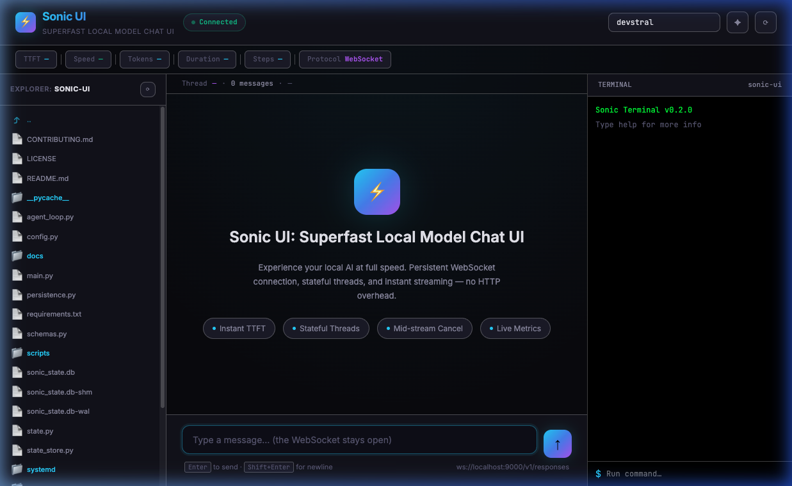

<div align="center">

# ⚡ Sonic UI: Superfast Local Model Chat UI

**A new, superfast chat interface for local models that brings the bare necessities of VS Code to your AI workflow.** Built on the high-performance [Sonic](https://github.com/mitkox/sonic) gateway, Sonic UI makes local LLMs feel instant.

Sonic UI delivers a premium, real-time experience for **Ollama**, **llama.cpp**, and **vLLM** — featuring an integrated file explorer and terminal without the burden of a bloated UI or massive token costs. Everything stays 100% local.



<br>

[](LICENSE)
&nbsp;&nbsp;
[](https://python.org)
&nbsp;&nbsp;
[](#websocket-protocol)

</div>

---

## Why Sonic UI?

Modern AI tools often come with heavy UI bloat or hidden token costs. Sonic UI is designed for developers who want the **bare necessities of a coding environment (Explorer + Terminal)** paired with a superfast, stateful chat interface.

By leveraging Sonic’s innovative WebSocket architecture, you get a genuine speed boost over traditional REST-based interfaces — without the overhead.

You get **all the speed benefits** of the original gateway, plus:

| Feature | What it means |
|:---|:---|
| ⌨️ **VS Code Essentials** | Integrated File Explorer and Terminal for a streamlined dev workflow |
| 🚀 **Superfast Chat** | Persistent WebSocket connection means zero reconnection latency |
| 📊 **Live Metrics** | TTFT, tokens/sec, and total duration updated in real-time |
| 🔁 **Stateful Threads** | History lives server-side; follow-ups only send the *new* message, slashing processing time |
| 🔌 **No Token Costs** | 100% local inference via Ollama, llama.cpp, or vLLM |
| ⬛ **Mid-stream Cancel** | Stop generation instantly with one click |
| 🏠 **Zero Bloat** | A focused, high-performance interface that stays out of your way |
| 🔌 **OpenAI REST Proxy** | Use it as a backend for Cline, Continue, and other tools via `/v1/chat/completions` |

### Where the speed comes from

Sonic's WebSocket mode eliminates the overhead of traditional REST:

```
REST (what Cline does):    New HTTP connection → send ALL messages → wait → close
WebSocket (what Sonic does):  One persistent connection → send only the new message → instant stream
```

On subsequent messages in a thread, Sonic uses `previous_response_id` to continue from the existing context — the backend only processes the new input, not the entire conversation again. This is where the **~50% speed improvement** lives.

---

## Quick Start

### 1. Install

```bash
git clone https://github.com/YOUR_USERNAME/sonic-ui.git
cd sonic-ui
python3 -m venv venv
source venv/bin/activate
pip install -r requirements.txt
```

### 2. Start your backend + Sonic UI

Choose your local AI backend below, then open **http://localhost:9000** in your browser.

---

## 🦙 Using with llama.cpp

[llama.cpp](https://github.com/ggerganov/llama.cpp) serves models via `llama-server` with a built-in OpenAI-compatible API.

**Start llama.cpp** (if not already running):

```bash
llama-server -m ./your-model.gguf --host 0.0.0.0 --port 8080
```

**Start Sonic UI** pointing at llama.cpp:

```bash
source venv/bin/activate
VLLM_URL=http://localhost:8080 \
MODEL_NAME=your-model-name \
ALLOWED_MODELS=your-model-name \
python -m uvicorn main:app --host 0.0.0.0 --port 9000
```

> **Tip:** To find your model name, run `curl http://localhost:8080/v1/models` and look for the `id` field.

**Open** → [http://localhost:9000](http://localhost:9000)

<details>
<summary><b>Example with Qwen3-Next</b></summary>

```bash
# Terminal 1: llama.cpp
llama-server -m qwen3-next-Q4_K_M.gguf --host 0.0.0.0 --port 8080 --ctx-size 8192

# Terminal 2: Sonic UI
VLLM_URL=http://localhost:8080 \
MODEL_NAME=qwen3next \
ALLOWED_MODELS=qwen3next \
python -m uvicorn main:app --host 0.0.0.0 --port 9000
```

</details>

---

## 🦙 Using with Ollama

[Ollama](https://ollama.com) serves models via its own API, which is OpenAI-compatible on `/v1/chat/completions`.

**Start Ollama** (if not already running):

```bash
ollama serve
ollama pull llama3.1    # or any model you prefer
```

**Start Sonic UI** pointing at Ollama:

```bash
source venv/bin/activate
VLLM_URL=http://localhost:11434 \
MODEL_NAME=llama3.1 \
ALLOWED_MODELS=llama3.1 \
python -m uvicorn main:app --host 0.0.0.0 --port 9000
```

**Open** → [http://localhost:9000](http://localhost:9000)

<details>
<summary><b>Using multiple models</b></summary>

```bash
VLLM_URL=http://localhost:11434 \
MODEL_NAME=llama3.1 \
ALLOWED_MODELS="llama3.1,codellama,mistral" \
python -m uvicorn main:app --host 0.0.0.0 --port 9000
```

Switch between models by changing the model name in the top-right input field of the UI.

</details>

---

## 🚀 Using with vLLM

[vLLM](https://github.com/vllm-project/vllm) is a high-performance inference engine. This is the backend Sonic was originally built for.

**Start vLLM:**

```bash
python -m vllm.entrypoints.openai.api_server \
  --model your-model-name \
  --host 0.0.0.0 --port 8000
```

**Start Sonic UI** pointing at vLLM:

```bash
source venv/bin/activate
VLLM_URL=http://localhost:8000 \
MODEL_NAME=your-model-name \
ALLOWED_MODELS=your-model-name \
python -m uvicorn main:app --host 0.0.0.0 --port 9000
```

**Open** → [http://localhost:9000](http://localhost:9000)

> **Note:** vLLM supports concurrent request batching. Use `showcase_sonic.py --concurrent-clients 8` to benchmark throughput.

---

## 🔌 Using with Cline, Continue, or any OpenAI-compatible tool

Sonic UI also exposes a standard **OpenAI REST API** at `/v1/chat/completions`, so tools like [Cline](https://github.com/cline/cline) and [Continue](https://continue.dev) can connect to it.

In your tool's settings:

| Setting | Value |
|:---|:---|
| **API Provider** | OpenAI Compatible |
| **Base URL** | `http://127.0.0.1:9000/v1` |
| **Model ID** | *(your model name, e.g. `qwen3next`)* |
| **API Key** | *(leave blank unless `REQUIRE_API_KEY=true`)* |

> **Note:** The REST proxy is a convenience layer. For the full speed benefits (stateful threads, persistent connection), use the WebSocket UI at `http://localhost:9000`.

---

## UI Features

### 💬 Chat Interface
Type a message and watch tokens stream in real time over WebSocket. The connection stays open between messages — no reconnection overhead.

### � Integrated File Explorer
Navigate your local project files directly from the sidebar. Just like VS Code, it lets you keep your codebase in view while you chat.

### ⌨️ Built-in Terminal
Run shell commands, manage files, or check logs without leaving the interface. Integrated seamlessly for an all-in-one developer experience.

### �📊 Live Metrics Bar
Every response displays real-time performance data:
- **TTFT** — Time to first token (lower is better)
- **Speed** — Tokens per second during generation
- **Tokens** — Total tokens in the response
- **Duration** — Wall-clock time from send to completion
- **Steps** — Number of agent steps taken

### 🔁 Stateful Threads
Each follow-up message uses `previous_response_id` to continue the conversation server-side. The backend only processes the new message, not the full history. Watch TTFT drop on follow-ups as the context is already warm.

### ⬛ Cancel Button
Click the red **■** button during generation to cancel mid-stream. Sonic sends `response.cancel` and the model stops immediately.

### ✦ New Thread
Click the **✦** button to start a fresh conversation. The WebSocket connection stays open — no reconnection needed.

---

## Configuration

All configuration is via environment variables:

| Variable | Default | Description |
|:---|:---|:---|
| `VLLM_URL` | `http://localhost:8000` | Backend API base URL |
| `MODEL_NAME` | `mitko` | Default model name |
| `ALLOWED_MODELS` | `MODEL_NAME` | Comma-separated list of allowed models |
| `PORT` | `9000` | Gateway port |
| `STATE_DB_PATH` | `./sonic_state.db` | SQLite state database path |
| `MAX_STEPS` | `8` | Maximum agent loop steps |
| `MAX_TOOL_CALLS` | `16` | Maximum tool calls per response |
| `DEFAULT_TEMPERATURE` | `0.2` | Default sampling temperature |
| `DEFAULT_TOP_P` | `0.9` | Default top-p sampling |
| `REQUIRE_API_KEY` | `false` | Require API key for connections |
| `API_KEY` | — | API key value (if required) |

### Performance tuning

- Keep `STATE_DB_PATH` on fast local disk (or `tmpfs`) for lowest latency
- Use `DEFAULT_TEMPERATURE≤0.2` and `DEFAULT_TOP_P≤0.9` for reliable tool-call behavior
- The gateway reuses persistent HTTP connections to the backend for better batching

---

## Project Layout

```
sonic-ui/
├── main.py              # FastAPI + WebSocket + REST proxy + UI serving
├── agent_loop.py         # Multi-step agent execution loop
├── vllm_client.py        # Backend SSE streaming client (works with any OpenAI-compatible API)
├── schemas.py            # Protocol validation + system prompt contract
├── config.py             # Environment variable configuration
├── state_store.py        # In-memory state backed by SQLite
├── persistence.py        # SQLite schema and operations
├── ui/
│   └── index.html        # WebSocket chat UI (served at /)
├── tools/
│   ├── registry.py       # Tool registry + execution policies
│   └── builtins/         # Built-in server tools
├── scripts/
│   ├── test_ws_client.py         # CLI streaming test client
│   ├── demo_tool_client.py       # Tool-loop demo
│   ├── demo_structured_output.py # Structured output demo
│   ├── showcase_sonic.py         # Full benchmark + value demo
│   └── run_showcase.sh           # All-in-one test + demo runner
├── tests/                # Test suite
├── docs/                 # Screenshots and documentation assets
├── systemd/              # systemd service file
└── requirements.txt      # Python dependencies
```

---

## WebSocket Protocol

The WebSocket endpoint at `ws://localhost:9000/v1/responses` speaks a clean event protocol:

**Inbound** (client → server):
| Event | Purpose |
|:---|:---|
| `response.create` | Start a new response (with optional `previous_response_id` for continuation) |
| `tool_result.submit` | Return a tool call result |
| `response.cancel` | Cancel the active response |

**Outbound** (server → client):
| Event | Purpose |
|:---|:---|
| `response.created` | Response acknowledged, includes `response_id` and `thread_id` |
| `response.output_text.delta` | Streaming text fragment |
| `response.step.created` / `.completed` | Agent step lifecycle |
| `response.tool_call.created` / `.completed` | Tool call lifecycle |
| `response.tool_result.waiting` / `.received` | Tool result handshake |
| `response.completed` | Response finished (status: `completed`, `cancelled`, or `failed`) |
| `error` | Error with code and message |

---

## CLI Test Clients

For scripted testing and benchmarking:

```bash
# Plain streaming
python scripts/test_ws_client.py --model qwen3next

# Agentic tool calling
python scripts/test_ws_client.py --agentic --first "Calculate 12*7 using tool calc" --model qwen3next

# Full benchmark showcase
python scripts/showcase_sonic.py --url ws://localhost:9000/v1/responses --model qwen3next --concurrent-clients 8

# All-in-one test + demo
scripts/run_showcase.sh
```

---

## Health Check

```bash
curl http://localhost:9000/healthz
# {"status":"ok"}
```

---

## Credits

Built on top of [mitkox/sonic](https://github.com/mitkox/sonic) — the WebSocket Responses gateway by [@mitkox](https://github.com/mitkox).

Sonic UI adds the browser interface, OpenAI REST proxy, and multi-backend documentation.

## License

[MIT](LICENSE)
